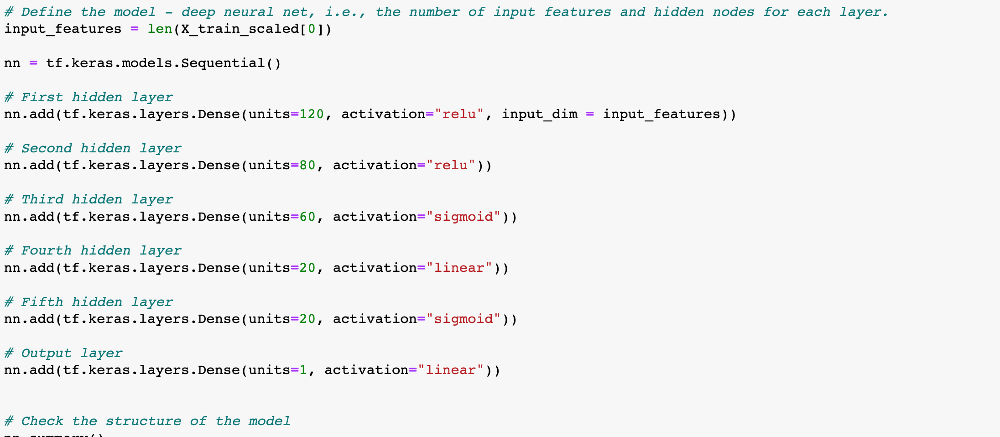
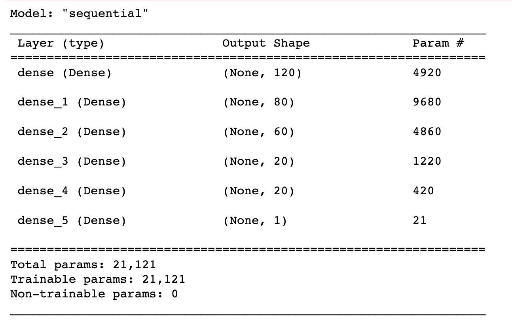
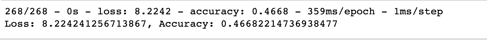

# Neural_Network_Charity_Analysis

## Overview of the analysis: 

This analysis aims to create a binary classifier capable of predicting whether applicants will be successful if funded by Alphabet Soup. The team will design a neural network, or deep learning model created with a binary classification model that can predict if an Alphabet Soup–funded organization will be successful based on the features in the dataset and optimize our model to achieve a target predictive accuracy higher than 75%. Initially, the goal is to preprocess the dataset to compile, train, and evaluate the neural network model.

## Results: 

### Data Preprocessing

* What variable(s) are considered the target(s) for your model?

Whether funding proves to influence success for those funded. [IS_SUCCESSFUL]

* What variable(s) are considered to be the features of your model?

Variables of focus included whether the application is successful, classification, application_type,   and both AMT variables. 

* What variable(s) are neither targets nor features and should be removed from the input data?

Variables excluded are EIN, NSME, SPECIAL_CONSIDERATIONS, and STATUS. 

### Compiling, Training, and Evaluating the Model

* How many neurons, layers, and activation functions did you select for your neural network model, and why?

For the model, the accuracy would not go beyond 54%. There were five layers in the final model - using the activation modes of rawly, rely on, sigmoid, linear, sigmoid, and linear, respectively. 
Below is the code for the units and activations for each layer. 

* Were you able to achieve the target model performance?

Unfortunately, the desired accuracy of 75% was not achieved; however, Tahn may be the missing classification link. 

* What steps did you take to try and increase model performance?

Units were increased as well ass the number of layers but ultimately, the model performed similarly, accuracy less than 55%.

## Summary: 

Ultimately, the final model should exclude additional categorical variables that, while important to our client, are not useful for the model. Again, there may be a place for the Tahn classification. In the future, in order to achieve %75 we may need a more extensive dataset or have more preliminary statistical analysis to identify the structure of the data before machine learning. 